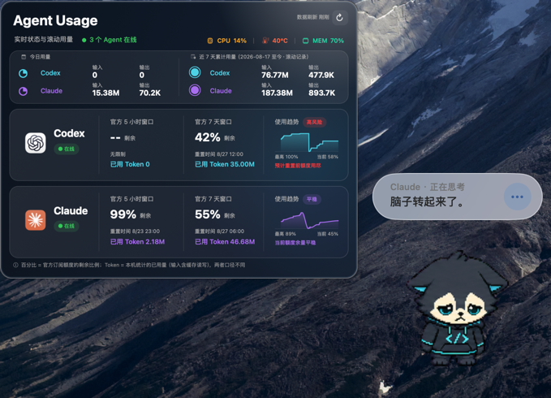

# CC Pets

[English](./README.md) | 简体中文

一个不依赖 Codex/Claude 桌面端的 macOS 原生桌宠。启动 Codex CLI 或 Claude Code CLI 时自动出现，
并从本机 `~/.codex/sessions` 与 Claude Code 官方 status line 数据中读取 5 小时额度、周额度和周重置时间。

## 展示模式

| 订阅展示模式 | API 调用展示模式 |
| --- | --- |
|  |  |

## 功能

- 随 Codex CLI 或 Claude Code CLI 自动启动，无需打开对应桌面版
- 多个 Codex/Claude CLI 共用一个桌宠，最后一个 CLI 退出后桌宠自动关闭
- 鼠标悬停口袋时展开额度详情面板，用两张卡分别显示 Codex、Claude 的剩余 5 小时额度、周额度和精确到秒的周重置时间
- reset 时间自动转换为 Mac 当前系统时区，例如 `Jul 22 3pm America/Los_Angeles` 在上海时区显示为 `7/23 06:00:00`
- 支持待机、左右拖动、身体两侧感应、头部/脚部悬停和点击反馈动画
- 待机呼吸、随机小动作（11 行素材会转头看鼠标）、拖动时的水平滞后与落脚回弹
- 桌宠以自己的口吻播报 Agent 状态，闲着时还会自己碎碎念，台词和频率都可自定义
- 支持拖动桌宠位置，右键刷新用量、检查更新或退出
- 响应 Codex 与 Claude Code Agent 的思考、工具调用、审批、子 Agent、完成和失败状态
- 在桌宠旁显示脱敏后的玻璃 Agent 状态卡片，可展开、折叠并显示活跃 CLI 会话数
- 支持第三方 CLI Agent 通过统一 Provider 事件协议接入动画和状态
- 可选记录最近 7 天的本地额度历史，并在额度卡片中显示趋势
- 可分别启用任务完成、失败和等待审批的 macOS 系统通知
- 内置一个原创素材，更多桌宠可从兼容 PetDex 的素材源按需下载到本机
- 使用原生 AppKit，运行时不依赖 Electron

## 互动方式

### Agent 工作状态

| Agent 事件 | 桌宠反馈 |
| --- | --- |
| 新会话启动 | 挥手唤醒 |
| 提交用户提示、Agent 思考 | 思考动画 |
| 执行 Shell 命令 | 跑动动画 |
| 编辑或写入文件 | 工作动画 |
| 读取、搜索或调用 MCP | 观察动画 |
| 等待审批 | 提醒动画 |
| 启动子 Agent | 子 Agent 动画 |
| 工具执行成功 | 完成动画 |
| 工具执行失败 | 失败动画 |
| 当前回合或子 Agent 结束 | 告别后恢复待机 |

Agent 动画分别由 Codex Hooks 和 Claude Code Hooks 驱动。首次安装或 Codex Hook 内容更新后，启动 Codex 并执行
`/hooks`，检查并信任 CC Pets Hook；未经信任的用户级 Hook 会被 Codex 安全机制跳过。
Claude Code Hook 会合并到 `~/.claude/settings.json`，现有的 `env`、`model`、`statusLine`
以及其他 Hooks 都会保留。额度采集块会注入现有 status line 脚本，但配置中的 `command`
仍保持原脚本路径，Claude Code 可以继续查找和修改该脚本；脚本输入会同时提供给原状态栏
和桌宠，原有输出不变。
通过 npm 安装或升级时会自动重新构建应用、安装或更新两套 Hooks，并配置 shell 集成；如果旧版桌宠正在运行，
安装器会自动重启桌宠，使新版本生效。`cc-pets install` 用于手动修复或重新初始化。

### 鼠标互动

| 操作               | 桌宠反馈                                                 |
|--------------------|----------------------------------------------------------|
| 鼠标移动到头部     | 播放头部互动动画                                         |
| 鼠标移动到口袋     | 播放口袋互动动画，并从桌宠左侧展开 Codex/Claude 额度面板 |
| 鼠标移动到脚部     | 播放脚部互动动画                                         |
| 鼠标移动到身体右侧 | 播放右侧感应动画                                         |
| 鼠标移动到身体左侧 | 播放左侧感应动画                                         |
| 单击桌宠           | 播放一次俏皮反馈动画                                     |
| 按住并向右拖动     | 播放向右拖行动画，同时移动桌宠                           |
| 按住并向左拖动     | 播放向左拖行动画，同时移动桌宠                           |
| 鼠标移开或拖动结束 | 恢复默认待机动画                                         |
| 右键桌宠           | 切换桌宠、刷新用量、设置历史/通知、检查更新或退出         |

右键菜单中的“切换桌宠”只扫描 `~/.cc-pets/pets/`（见 [素材管理](#素材管理)）和包内素材，
**不会**去读 `~/.petdex/pets/` 和 `~/.codex/pets/`——那两个目录由 PetDex CLI 和 Codex 写入，
混在一起就找不到自己装的宠物了。要用 Codex 那边的素材，打开右键菜单里的“导入 Codex
素材”开关，它们会被复制进你自己的目录（见 [导入 Codex 素材](#导入-codex-素材)）。

外部桌宠使用目录名作为菜单名称，内置桌宠使用素材文件名（不显示扩展名）。选择后立即
切换并持久保存；下次启动会继续使用上次选择的桌宠。该菜单只负责切换已有素材，不提供
添加或删除功能。

素材列表在启动时加载一次，之后按 `~/.cc-pets/pets/` 的修改时间判断是否需要重扫：
`cc-pets pet add` / `remove` 会改动这个目录，因此增删素材后打开菜单就能看到，
不需要重启桌宠，也不需要重新编译；没有增删时打开菜单只做一次 `stat`，不会遍历目录。

外部素材遵循 Codex 桌面端的 `spriteVersionNumber` 协议：字段缺失或为 `1` 时按
`1536×1872`、`8×9` 网格解析；为 `2` 时按 `1536×2288`、`8×11` 网格解析。
v2 新增的最后两行用于十六向鼠标跟随；只在桌宠空闲时启用，拖动、悬停互动和
Agent 状态动画会优先播放。

交互区域存在重叠时，按“口袋、头部、脚部、身体左右侧”的优先级识别。拖动超过
3 像素后才进入拖动状态，避免普通点击被误判为拖动。

素材行与行为的对应关系：

1. 默认待机（6 帧）
2. 向右拖动（8 帧）
3. 向左拖动（8 帧）
4. 身体右侧感应（4 帧）
5. 头部悬停（5 帧）
6. 口袋悬停与额度展示（8 帧）
7. 脚部悬停（6 帧）
8. 点击反馈（6 帧）
9. 身体左侧感应（6 帧）

右键菜单中的“记录本地额度历史”默认关闭。启用后只在本机
`~/Library/Application Support/CC Pets/quota-history.json` 保存最近 7 天的数据，
每 15 分钟最多记录一次。系统通知也默认关闭，可在“系统通知”子菜单中分别启用任务完成、
任务失败和等待审批通知。

Agent 状态卡片会根据屏幕剩余空间自动显示在桌宠上方或下方。点击桌宠旁的圆形箭头可以
折叠卡片；折叠后圆钮会显示当前活跃的 Codex/Claude CLI 会话数，点击后重新展开。卡片只展示
Provider、脱敏状态和通用说明，不提供消息输入，也不会显示提示词、命令正文或模型输出。
连续 1 分钟没有收到新的 Agent 状态事件时，卡片和圆钮会一起自动隐藏；下一次收到事件时
会重新显示并重新计时。

## 碎碎念

桌宠会以自己的口吻讲话：Agent 干活时讲的话直接写在状态卡副行上，闲着的时候单独冒气泡。
右键菜单「碎碎念」里可以整体开关、调频率、改台词。

### 频率

四个档位，一个开关同时管住四道闸——它们互相牵制，单调其中任何一道都不会真的变频繁：

| 档位         | 每小时最多 | 两句最短间隔 | 静默多久才算闲 | 每次判定的出话概率 |
|--------------|------------|--------------|----------------|--------------------|
| 很少         | 2 句       | 480 秒       | 300 秒         | 15%                |
| 正常（默认） | 4 句       | 240 秒       | 180 秒         | 25%                |
| 较多         | 8 句       | 120 秒       | 90 秒          | 45%                |
| 话痨         | 20 句      | 45 秒        | 45 秒          | 70%                |

Agent **正在干活**时（思考、调用工具、等待审批、子 Agent 工作等）不会插嘴，状态卡上的
工作文案优先级最高。只有状态卡处于「待机中」或压根没显示时才会碎碎念——所以开着终端
也照样会说话，不需要退出 CLI。借走状态卡副行说完一句后，副行会自动还原成状态文案。

### 编辑台词

右键菜单「碎碎念 → 编辑台词…」打开内置编辑器。桌宠说的**所有**话都在
`~/.cc-pets/speech.txt` 里，代码里没有第二份词库——首次启动时从 app 内的默认词库
拷一份出来，之后就只认这个文件。

语义只有一条：**文件里有什么就说什么**。没有合并、没有 replace、没有兜底，
删掉一节就是那个情境不吭声。

```
# 井号开头是注释，行尾的 " #" 之后也是注释
[idle]                  # 闲着没事
又没人理我。
今天也是划水的一天。
```

- `[情境]` 起一节，下面一行一句，直接改字、加行、删行
- 每句 30 字以内，超了那一行会被丢掉
- 写错只丢那一行，不会让整个文件失效

可以插入这些实时数据（连花括号一起写）：`{quota5h}` `{resetTime}` `{toolName}`
`{sessionMin}` `{failCount}` `{hour}`。取不到值时，用到该槽位的那一句会被整条跳过，
不会显示占位符。

编辑器的三个按钮：

- **试说一句** —— 选一个情境，桌宠当场把那一节里的一句说出来。读的是编辑器里
  **还没保存**的文本，槽位用示例数据填，所以不用等到真的额度告急才能看到效果
- **恢复默认台词…** —— 把编辑器内容换成默认词库，按 ⌘Z 可撤销，不保存不写文件
- **保存**（⌘S）/ **保存并关闭**（⏎）—— 保存时校验，问题当场列出来。
  校验没过或被 mtime 冲突取消时不会关窗，改动不会跟着窗口一起消失

### 给单只宠物写专属台词

上面那份 `speech.txt` 是**所有**宠物的通用台词。想让某一只换个口吻，编辑器顶部有一个
「**通用** / **当前宠物 · ×××**」的切换——切到右边，写的就只属于当前这只宠物，
存在 `~/.cc-pets/speech/<宠物名>.txt`（内置素材是 `builtin-默认.txt`）。

这一页**初次打开是空白的，这是正常的**：空白 = 这只宠物全部沿用通用台词。
不知道能写什么就点右上角 **填入默认模板**，它会把整份默认台词以**注释状态**填进来
（每行都以 `#` 开头，一句都不生效，这只宠物说的还是通用台词）。想让哪一节归它自己管，
把那一节行首的 `#` 去掉再改字就行。

手写的话，**只写想改的小节**就行：

```
# ~/.cc-pets/speech/external-哆啦A梦.txt
[idle]
铜锣烧…
口袋里好像有点东西。

[done]
诺，任意门给你。
```

这样它闲着和完工时说自己的话，其余情境照旧用通用的。三种写法对应三种结果：

| 专属文件里 | 结果 |
| --- | --- |
| 没写这一节 | 用通用的 |
| 写了，下面有台词 | **整节接管**，通用的那一节一句都不参与 |
| 写了标签，下面空着 | 这只宠物在这个情境不吭声 |

注意是**整节替换而不是混着说**：写了 `[idle]` 的三句，它闲着时就只在这三句里挑。

专属这一页的规则比通用那份松得多——缺小节本来就是常态，所以「标签不能删」和
「`[state_*]` 至少留一句」两条都不适用，只剩逐行的那些检查（超长、槽位拼错、小节名写错）。
「试说一句」在专属没写该小节时会照实说出通用的那一句，并注明「这一节来自通用台词」。
按钮此时也变成 **清空这一页…**：清空即全部回落到通用，专属词库没有「默认」这个概念。
「填入默认模板」填的是注释版而不是直接可用的整份台词，也是同一个道理——直接填进
22 节未注释的台词，这只宠物就每一节都自己管、再也不会回落了，那正好毁掉这一页的用法。

切换宠物后编辑器会自动跟到新那只身上；这一页有没保存的改动时会先问一句。
删掉某只宠物的素材不会删它的专属台词文件，重新装回同名素材时台词还在。

校验分两级：

标签行是配置项，22 个一个都不能删。删掉之后编辑器里就看不见它了，用户既不知道少的是
哪个也不知道该写成什么样，所以保存时会**自动把标签加回原位**——台词还在的话会连同台词
一起归位——并在提示里说明补了哪些。能不能留空才分两种：

| | 行为 |
| --- | --- |
| 任何一行 `[标签]` 被删掉 | **自动加回原位**并告知，⌘Z 可撤销 |
| `[state_*]` 标签还在但台词删光了 | **拦下不给保存**。状态卡副行的正文只有这一个来源 |
| 情绪句标签还在但台词删光了 | 提示。这是合法选择，就是那个情境不主动开口 |
| 小节名拼错、句子超长、散句不在任何情境下 | 提示，只影响那一行 |
| 槽位名拼错（如 `{quotaLeft}`） | 提示。这类最难自查——句子看着没问题，运行时被整条跳过 |

文件被外部编辑器同时改过时，保存前会问一次，可以选覆盖或重新载入。

情境标签是稳定契约，不随版本改名：

- 情绪句（受频率档位的预算限制）：`done` `fail` `quota_low` `late_night` `long_session` `wake` `idle`
- 状态卡副行（由 Agent 事件驱动，不受预算限制）：`state_starting` `state_idle` `state_thinking`
  `state_auto_review` `state_approval` `state_subagent` `state_tool` `state_tool_bash`
  `state_tool_edit` `state_tool_read` `state_tool_done` `state_tool_failed` `state_completed`
  `state_failed` `state_notification`

### 调试开关

以下键用于调试和微调，现读现生效，不用重启。**域名是 bundle identifier
`com.universewang.cc-pets`**，写成 `cc-pets` 会落到另一个 plist 里，桌宠永远读不到，
表现为「设了没反应」：

```sh
defaults write com.universewang.cc-pets CCPetsSpeechFrequency -string chatty
defaults write com.universewang.cc-pets CCPetsSpeechCooldown -float 0      # 覆盖档位里的间隔
defaults write com.universewang.cc-pets CCPetsSpeechHourlyBudget -int 100  # 覆盖档位里的预算
defaults write com.universewang.cc-pets CCPetsBoredomScale -float 0.1      # 压缩无聊曲线与静默门槛
defaults write com.universewang.cc-pets CCPetsSpeechDebugTag -string quota_low  # 立刻弹一次，弹完自动清
defaults delete com.universewang.cc-pets CCPetsSpeechCooldown             # 交回档位
```

## 系统要求

- macOS 13 或更高版本
- Node.js 18 或更高版本
- 已安装并登录 Codex CLI 和/或 Claude Code CLI
- zsh
- Xcode Command Line Tools，可通过 `xcode-select --install` 安装

## 安装

### npm 安装

```bash
npm install -g cc-pets@latest --allow-scripts=cc-pets
# 首次安装后新开一个终端
codex
# 或
claude
```

`--allow-scripts=cc-pets` 用于允许新版 npm 执行 CC Pets 的 `postinstall`，完成原生应用构建、
Hooks、shell 集成和 `~/Applications/CC Pets.app` 的安装。缺少它时安装仍会成功退出，
但这些步骤一个都不会执行。

如果已经只执行了 `npm install -g cc-pets@latest`，并看到 npm 提示安装脚本尚未获准，
可以在包安装完成后手动初始化：

```bash
cc-pets install
```

#### 关于安装脚本白名单

npm 12 起默认启用安装脚本白名单：不在白名单里的包不会执行 `postinstall`，而安装过程仍以
成功退出。此时原生应用、Hooks 和 shell 集成都没有装上，表现为敲 `codex` / `claude` 时
桌宠不出现。不想每次都带 `--allow-scripts` 参数的话，可以配置一次持久白名单：

```bash
npm config set allow-scripts=cc-pets --location=user
```

白名单只对之后的安装生效，不会补跑已经被拦下的脚本，因此配置完需要重装一次。

### 本地源码安装

```bash
git clone https://github.com/Sunnyshinnny776/cc-pets.git
cd cc-pets
npm install -g . --ignore-scripts
cc-pets install
# 首次安装后新开一个终端
codex
# 或
claude
```

npm 12 会把本地目录安装识别为项目范围安装，不接受命令行传入的 `--allow-scripts`。
因此本地源码安装显式跳过生命周期脚本，再通过 `cc-pets install` 执行可重复的初始化流程。

两种方式都会安装 `cc-pets`、`codex-with-pet` 和 `claude-with-pet`。
npm 的安装后脚本会自动构建原生应用、安装两套 Agent Hooks，并在 `~/.cc-pets/shims` 下生成指向包装脚本的
`codex` 与 `claude` 软链，再向 `~/.zshrc` 追加带明确标记的一行把该目录前置到 `PATH`，不会覆盖真实的 CLI 二进制。
用 shim 而不是 alias，是因为 alias 名区分大小写而 macOS 文件系统默认不区分：`Claude`、`CODEX` 这类写法
匹配不到 alias，会直接命中真二进制，桌宠不会被拉起。shim 让任意大小写写法都落到同一个文件上。
首次安装需要新开终端让 `PATH` 生效；以后升级只需执行 npm 命令。
同时会将标准 macOS 应用安装到 `~/Applications/CC Pets.app`，可从 Finder 或 Launchpad 启动，
不需要管理员权限。npm 升级时会同步更新该应用。

安装完成后也可以右键桌宠并选择“检查更新…”。应用会查询 npm Registry，发现新版本后请求确认，
随后在后台复用首次安装时记录的 Node.js/npm 完成升级；用户无需打开终端。升级会同步更新原生应用、
Codex/Claude Hooks 和 shell 集成，并自动重启正在运行的桌宠。自动更新不会请求管理员权限；如果原来的
全局 npm 目录不可写或 Node.js/npm 已被移动，应用会保留旧版本并显示更新日志和手动升级命令。

### 指定真实 CLI 路径

如果真实 Codex CLI 不在当前 `PATH`，可以显式指定：

```bash
export CODEX_REAL_BIN=/absolute/path/to/codex
```

包装器不会读取或执行 `.env`，只会把当前终端环境原样传给真实 Codex。Codex CLI 会按自身规则
读取 `${CODEX_HOME:-~/.codex}/.env`，因此代理和其他 Codex 配置不需要由桌宠重复加载。

如果真实 Claude Code CLI 不在当前 `PATH`，可以显式指定：

```bash
export CLAUDE_REAL_BIN=/absolute/path/to/claude
```

## 命令说明

```bash
# 构建原生程序
cc-pets build

# 独立启动桌宠；独立启动时不会随 CLI 自动退出
cc-pets

# 前台运行，便于调试
cc-pets --foreground

# 查看当前安装版本（也支持 cc-pets -v）
cc-pets --version

# 查看当前解析到的 Codex 额度
cc-pets --status

# 查看本机额度历史 JSON
cc-pets --history

# 清理可重建的临时状态、更新日志和构建缓存，保留历史、配置与偏好
cc-pets clean

# 管理 ~/.cc-pets/pets 里的桌宠素材，详见「素材与版权」
cc-pets pet search otter
cc-pets pet add boba
cc-pets pet list

# 从标准输入发送第三方 Provider 状态事件
printf '%s' '{"schemaVersion":1,"provider":"MyAgent","state":"thinking"}' \
  | cc-pets provider-event

# 手动修复或重新初始化 Hooks、shell 集成，并让已运行桌宠加载当前版本
cc-pets install

# 安全移除 Hooks、恢复 Claude status line，并清理 shell 集成
cc-pets uninstall

# 完整移除集成、应用和全部本地数据；执行前会再次确认
cc-pets uninstall --purge

# 仅删除 ~/Applications 中的 macOS 应用（不会删除 npm 包或 Hooks）
cc-pets uninstall-app

# 启动桌宠后进入 Codex CLI
codex-with-pet

# 启动桌宠后进入 Claude Code CLI
claude-with-pet
```

项目版本以 `package.json` 为唯一来源。发布新版本时执行 `npm version patch`、
`npm version minor` 或 `npm version major`；npm 会自动运行完整测试，构建过程会将新版本写入
生成的 App `Info.plist`，无需手动修改 `Resources/Info.plist`。

## 用量数据

Codex 用量来自 `~/.codex/sessions` 的本地 `token_count` 事件：

- `window_minutes = 300` 对应 5 小时额度
- `window_minutes = 10080` 对应周额度
- 桌宠将 `used_percent` 换算为剩余百分比后显示
- Codex 本地 Token 按服务端 `resets_at - window_minutes` 到 `resets_at` 聚合，
  与官方 5 小时和 7 天额度周期保持一致
- Token 统计包含输入、缓存输入、缓存写入、输出、推理输出与总量；面板展示总量
- Codex 当前事件未提供某个额度窗口时显示 `--`，不会使用已过期的历史额度冒充当前值

Claude 用量来自官方 status line 输入中的 `rate_limits.five_hour` 与
`rate_limits.seven_day`。其中的 `used_percentage` 会换算为剩余百分比。该字段仅面向
Claude.ai Pro/Max 订阅账号，并在会话完成首次 API 响应后出现；字段尚不可用时显示 `--`。

Claude Code 本地 Token 来自 `~/.claude/projects` 下的会话转录：

- 每条 `type = assistant` 的记录带 `message.usage`，是**单次请求的增量**，与 Codex 的
  会话累计值不同，因此按时间戳逐条落窗口累加
- 窗口同样对齐 `resets_at`；Claude 的 `rate_limits` 不含 `window_minutes`，窗长按官方
  订阅固定为 300 / 10080 分钟
- `--resume`、fork 和 compact 会把旧记录原样复制进新的转录文件，因此按
  `message.id + requestId` 全局去重（两者缺失时回退行级 `uuid`），否则用量会明显虚高
- 统计包含输入、缓存读取、缓存写入、输出与总量；Claude 的思考 token 已计入
  `output_tokens`，不单列推理项

Claude Code 支持用 `CLAUDE_CONFIG_DIR` 把配置目录指到别处，同一台机器因此可能存在多个
配置目录（不同账号、各自独立的额度周期）。桌宠**固定只统计 `~/.claude`**，不读
`CLAUDE_CONFIG_DIR`：桌宠是被某个客户端启动的常驻进程，会一直带着启动时的环境，用它选
目录等于永久绑定到"第一个拉起桌宠的账号"。确实把配置目录整体搬走的用户可以设
`CC_PETS_CLAUDE_CONFIG_DIR`（与 `CC_PETS_STATE_DIR` 等覆盖变量同一套约定），正常使用下
不需要设置。

额度文件按配置目录分开存放，因此多个配置目录的 status line 不会互相覆盖——否则面板会
把一个账号的剩余百分比配上另一个账号的用量。

Codex 侧同理：桌宠固定只统计 `~/.codex`，不读继承来的 `CODEX_HOME`，需要时用
`CC_PETS_CODEX_HOME` 覆盖。跑在 Codex 会话里的记录端（Agent Hooks、安装脚本）照常认
`CODEX_HOME`，那是会话级的、不存在被常驻进程带跑的问题。

本地 Token 是 CLI 会话事件的原始计数，不等同于订阅额度。官方额度可能受模型、缓存和
请求复杂度等因素影响，应始终以服务端返回的百分比为准。

额度详情面板使用青色区分 Codex、紫色区分 Claude。标题行显示在线 Agent 数，下方汇总条
分别展示 Codex、Claude 的「今日」与「最近 7 天」Token，并显示最近刷新时间。统计用的是与订阅无关的
自然日窗口（今日 = 本机零点至今，最近 7 天 = 含今天在内的 7 个自然日），因为两家的
`resets_at` 并不一致，按各自订阅窗口算出的数不在同一区间上，相加没有意义。每个 Agent 卡片按 5 小时和 7 天两列
展示官方剩余百分比（主值）、本机 Token 用量和重置时间，右侧是近 7 天额度趋势。右键菜单的
“用量展示模式”可分别为 Codex、Claude 选择“订阅额度”或“API 用量”；API 用量模式只替换对应
卡片内部，展示本月调用次数、本月输入/输出 Token、较上月同期变化和本月按日 Token 趋势。
“调用次数”来自本机会话记录：Claude 按请求标识去重，Codex 按去重后的累计 Token 快照计数。
某个窗口
当前没有额度数据时该列标注"当前无活跃窗口"。卡片上的在线徽章表示该 Provider 是否还有
运行中的客户端（包装脚本写出的 pid 文件，或该 Provider 最近 60 秒内仍在发事件），与是否
已采集到额度数据无关；客户端退出后显示"离线"，从未采集到数据时显示"等待数据"。经
`codex-with-pet` / `claude-with-pet` 启动的会话退出后 3 秒内转为离线；直接运行 `codex` /
`claude` 时没有可靠的退出信号，最多需要 60 秒静默才会转为离线。服务端的 Unix 时间戳会使用 Mac 当前系统时区
格式化为 `M/d HH:mm`；因此它与 CLI 中标注其他时区的同一时刻可能日期和小时不同，但代表
同一个真实时间。
应用通过文件事件实时读取额度，并保留 120 秒容错刷新；右上角刷新按钮也可立即读取本地数据。Codex 数据随本地 session 更新，Claude 数据则要等 Claude Code
下一次把 `rate_limits` 传给 status line 后才会变化，按钮不会主动请求 Claude 服务端。
面板使用原生 AppKit 毛玻璃材质，以紧凑悬浮卡片形式显示在桌宠左上方，并优先使用本机官方 Codex、Claude 应用
图标。鼠标从口袋移动到面板后可继续停留查看，移出两者后面板会延迟收起；拖动桌宠时
面板会保持显示并实时跟随位置。

第三方 CLI Agent 可以使用统一 Provider 事件协议复用状态气泡、动画和通知能力，协议说明见
[PROVIDER_PROTOCOL.zh-CN.md](./PROVIDER_PROTOCOL.zh-CN.md)。协议不接收命令正文、提示词或模型输出。

可以独立验证解析结果：

```bash
./scripts/build.sh
./.build/release/cc-pets --status
```

## 素材与版权

**本项目不自建素材仓库。** 仓库和 npm 包里只有一个内置素材 `默认.webp`（原创角色
ByteMochi，随代码按 MIT License 分发）。其余桌宠素材一律**由用户自己从素材源按需下载**
到本机 `~/.cc-pets/pets/`，既不进仓库，也不进 npm 发布包。

`cc-pets pet` 兼容 [PetDex](https://petdex.dev) 的公开清单接口：清单读
`https://petdex.dev/api/manifest`，下载只接受清单中位于 `assets.petdex.dev` 的资源地址。
CC Pets 只负责把素材取回本机并渲染，不修改、不转存、不再分发；素材的著作权归各自作者
和平台所有，使用前请遵守 PetDex 与素材作者的许可和使用条款。桌宠不会直接读取 PetDex CLI
或 Codex 桌面端的素材目录；Codex 素材可通过应用内导入功能复制到 CC Pets 自有目录。

格式方面，内置素材按 `8×9` 网格解析；外部 Codex/PetDex 素材支持
`spriteVersionNumber` v1（`1536×1872`、`8×9`）和
v2（`1536×2288`、`8×11`），单元格均为 `192×208`，前九行遵循相同的动作协议。
程序会自动收集 `Sources/CCPets/Resources/` 下的 `.webp` 和 `.png` 作为内置素材——
向仓库提交新的内置素材时，必须是原创作品或带有允许再分发的明确许可证，
受版权保护的角色不要放进来。

### 素材管理

`cc-pets pet` 把素材下载到 cc-pets 自己的目录 `~/.cc-pets/pets/<名称>/`，不写
`~/.petdex/pets/` 和 `~/.codex/pets/`：

```bash
cc-pets pet search otter      # 搜索可用素材（不带关键词就列全部）
cc-pets pet add boba          # 下载到 ~/.cc-pets/pets/boba/
cc-pets pet add boba doraemon # 一次装多个
cc-pets pet list              # 列出已安装的素材，按来源分组
cc-pets pet remove boba       # 删除
cc-pets pet source            # 列出可用的素材源
cc-pets pet dir               # 打印素材目录路径
```

#### 素材源

素材来自「源」（source），当前内置 [PetDex](https://petdex.dev)（默认）。名称可以带源前缀，
不带就用默认源：

```bash
cc-pets pet add petdex:boba
cc-pets pet search petdex:otter
```

一个源的完整定义就是清单地址、资源 host 白名单和 Referer 三项，集中在
`scripts/pet-store.mjs` 顶部的 `SOURCES` 表里。以后接自建 registry 时在表里加一行即可，
命令、目录结构和桌宠端都不用改。默认源用 `CC_PETS_SOURCE` 切换。

来源记录在宠物目录内的 `.source.json`（`{ "source", "slug", "installedAt" }`），下载来的
`pet.json` 保持上游原样、不掺自己的字段。目录名就是素材本名，所以桌宠右键菜单里看到的
仍然是干净的 `boba` 而不是 `boba@petdex`。

不同源出现同名素材时，`add` 会拒绝覆盖并提示改名安装；手工放进去、没有来源记录的目录同样
受保护：

```bash
cc-pets pet add petdex:boba --as boba-petdex
cc-pets pet add boba --as 波霸
```

`--as` 的本地名支持中文；为避免路径穿越，不允许路径分隔符、空白或连续的 `..`。

同一个源重装同名素材则直接更新，不需要 `--as`。

#### 导入 Codex 素材

桌宠不读 `~/.codex/pets/`。如果你在 Codex 桌面端已经装了一批素材，打开右键菜单里的
**“导入 Codex 素材”** 开关，桌宠会把那里的素材**复制**进 `~/.cc-pets/pets/`：开关打开的
当下导入一次，之后每次启动再导入一次。

- 复制而不是关联：导入之后 Codex 那边再改再删都不影响桌宠，桌宠也仍然只需要扫一个目录。
- 只导入真正有精灵图的目录，没有 `spritesheet.webp` / `spritesheet.png` 的会跳过。
- **同名目录一律跳过、绝不覆盖**——你自己 `cc-pets pet add` 装的素材优先。
- 导入的素材会写上 `.source.json`（`source: "codex"`），`cc-pets pet list` 里单独分一组。

反复启动是幂等的：已经导入过的素材因为同名而跳过，不会重复复制。关掉开关不会删除已经
导入的素材，想删用 `cc-pets pet remove`。

#### 其他

素材清单按源分别缓存 6 小时，加 `--refresh` 强制刷新。下载只接受源白名单内的 host（PetDex
是 `https://assets.petdex.dev`）。`CC_PETS_PETS_DIR` 可以换一个素材目录，CLI 和桌宠端读同一
个变量；注意桌宠是用 `open` 启动的，不继承 shell 环境，要让它也认这个变量需要
`cc-pets --foreground` 或 `launchctl setenv`——和 `CC_PETS_CLAUDE_CONFIG_DIR` 等其他覆盖变量
的限制一致。

安装完成后，打开桌宠右键菜单即可看到对应目录名。也可以自己把 `spritesheet.webp` /
`spritesheet.png` 和 `pet.json` 放进 `~/.cc-pets/pets/<名称>/`，效果相同，`list` 会把它们
归到「本地素材（无来源记录）」下。

PetDex 官方 CLI（`npx petdex install <slug>`）会把素材放在 `~/.petdex/pets/`；CC Pets 不读取
该目录。如需在 CC Pets 中使用素材，请通过 `cc-pets pet add` 安装到自有目录。

项目允许在没有内置素材时构建。若启动时内置目录和所有外部目录都没有可用素材，应用会显示
提示窗口，可打开 `~/.cc-pets/pets/`、安装素材后重新扫描，或安全退出。

## 隐私

- Codex 额度与 Token 只从本机 `~/.codex/sessions` 读取（可用 `CC_PETS_CODEX_HOME` 覆盖）。
- Claude 额度只从 Claude Code 传给本机 status line 的 `rate_limits` 字段读取。
- Agent Hooks 只向当前用户的临时目录写入桌宠事件和额度缓存。
- 额度历史默认关闭；启用后只在本机保留最近 7 天的剩余比例快照。
- 状态气泡和通知只显示 Provider、状态及脱敏工具类别，不显示会话正文。
- 项目不上传会话内容、额度、凭据或使用统计，也不包含遥测服务。
- 右键“退出桌宠”或执行 `cc-pets uninstall` 后，不会继续运行后台守护进程。

## 卸载

先在 npm 包仍然存在时移除集成：

```bash
cc-pets uninstall
cc-pets uninstall-app
source ~/.zshrc
npm uninstall -g cc-pets
```

卸载器只删除带 CC Pets 标记的 Codex/Claude Hooks、`~/.zshrc` 里的 shim 段和 `~/.cc-pets/shims` 下由
CC Pets 建立的软链，并恢复安装前的 Claude status line；其他用户配置和 Hooks 会保留。

## 项目声明

CC Pets 是社区开源项目，与 OpenAI、Anthropic、PetDex 及任何角色版权方不存在隶属、授权
或官方合作关系。Codex、ChatGPT、Claude 及相关图标和商标归各自权利人所有。

## License

项目代码和原创默认素材 ByteMochi 采用 [MIT License](./LICENSE)。外部素材不因本项目许可证而自动获得授权，
详见 [THIRD_PARTY_NOTICES.zh-CN.md](./THIRD_PARTY_NOTICES.zh-CN.md)。
